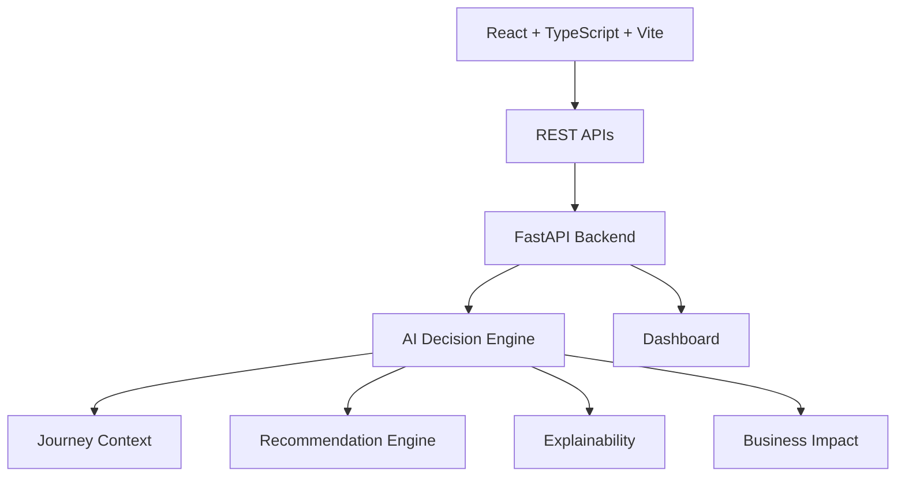

# JourneyMind AI — Architecture Overview

A concise guide to the system for GitHub documentation and a 3-minute technical walkthrough.

---

## 1. High-Level Overview

JourneyMind AI is an **AI-powered travel disruption orchestration platform** built as a hackathon-ready prototype. It uses a **React + TypeScript + Vite** frontend, a **FastAPI** Python backend, and a simple in-memory AI decision engine to detect flight disruptions, evaluate recovery alternatives, explain recommendations, predict business impact, and answer traveler questions through a conversational copilot.

---

## 2. System Architecture

The frontend calls the FastAPI backend over HTTP. The backend builds the journey context, runs the decision engine, and returns a single dashboard payload that drives the UI.

---

## 3. Technology Stack

| Layer           | Technology                          | Purpose                                  |
|-----------------|-------------------------------------|------------------------------------------|
| Frontend        | React + TypeScript + Vite           | Dashboard UI                             |
| Backend         | FastAPI (Python)                    | REST APIs                                |
| Communication   | REST / JSON                         | Client-server communication              |
| AI Layer        | Decision Engine                     | Evaluate disruption and recommend recovery |
| Data            | In-memory state (demo)              | Prototype state management               |
| Testing         | Playwright                          | End-to-end testing                       |

> **Note:** The demo uses in-memory state. In production this would be replaced by a persistent store such as **PostgreSQL** plus event-driven state management.

---

## 4. Request Flow

1. The user opens the dashboard at `http://localhost:3000`.
2. The frontend calls `GET /dashboard`.
3. The backend builds the journey context from the current flight, weather, alternatives, and services.
4. The AI decision engine evaluates alternatives and selects the top recommendation.
5. The backend returns the recommendation, explainability data, business impact, timeline, and alerts.
6. The user views recommendations and optionally accepts one.
7. The frontend calls `POST /rebook` with the chosen alternative.
8. The backend updates the current itinerary, timeline, and business impact.
9. The dashboard refreshes and shows the new journey.

---

## 5. Key REST APIs

| Method | Endpoint              | Description                                                                  |
|--------|-----------------------|------------------------------------------------------------------------------|
| GET    | `/`                   | Health/status endpoint.                                                      |
| GET    | `/dashboard`          | Returns the full dashboard payload: flight, alternatives, recommendations, timeline, business impact, explainability, and more. |
| GET    | `/recommendations`    | Returns the ranked recommendations plus available alternatives.              |
| POST   | `/rebook`             | Accepts an alternative ID and updates the current itinerary and journey context. |
| POST   | `/chat`               | Accepts a traveler message; returns an AI-generated or mock fallback reply grounded in the current journey. |
| GET    | `/alerts`             | Returns active disruption alerts.                                            |
| GET    | `/mockdata`           | Returns the complete raw mock dataset for debugging.                         |

There is no separate `/alternatives` endpoint; alternatives are bundled inside `/dashboard` and `/recommendations`.

---

## 6. AI Decision Engine

The decision engine is a lightweight, deterministic orchestration layer in `backend/main.py`. It performs the following steps on every dashboard load:

- **Detect disruption:** Compares the scheduled and estimated departure/arrival times to flag delays.
- **Evaluate alternatives:** Loads the pre-defined flight, rail, and upgrade alternatives.
- **Score options:** Uses per-alternative confidence scores and decision factors (e.g., lowest arrival delay, transfer risk, passenger preference, weather, carbon impact).
- **Generate recommendations:** Ranks alternatives and produces the top recommendation.
- **Produce explainable reasoning:** Builds a human-readable list of inputs, process steps, and decision factors.
- **Calculate business impact:** Surfaces estimated support calls avoided, delay reduction, customer satisfaction change, operational confidence, and carbon impact based on the selected alternative.

For the demo, reasoning is deterministic and based on curated mock data. The `/chat` endpoint can optionally call OpenAI, but falls back to a context-aware mock reply so the demo works without API keys.

---

## 7. Frontend Responsibilities

`frontend/src/App.tsx` is a single-page dashboard that renders:

- **Journey Summary:** Headline summary of what the AI has done so far.
- **Flight Card:** Current flight status, gate, seat, boarding/departure/arrival times, and delay badge.
- **Timeline:** Chronological journey events from check-in to hotel check-in.
- **Recommendations:** Ranked recovery alternatives with confidence, reasons, and business value.
- **Explainability:** Modal showing inputs, process, decision factors, and final recommendation.
- **Business Impact:** KPI strip and detailed metrics (delay reduction, confidence, customer impact, carbon).
- **Copilot:** Chat interface for traveler questions grounded in the current journey.
- **Architecture Modal:** Visual explanation of the system design.
- **API integration:** Polls `/dashboard` on load and calls `/rebook` and `/chat` as needed.

---

## 8. Production Evolution (Future Architecture)

This section describes a likely production path, **not** the current hackathon prototype.

- **PostgreSQL:** Persistent traveler, itinerary, and event history.
- **Live airline APIs:** Real-time flight status, schedules, rebooking, and seat maps.
- **Weather feeds:** Current conditions and forecasts at origin and destination.
- **LLM-powered reasoning:** Retrieval-augmented generation over live data for richer copilot answers.
- **Event-driven architecture:** Ingest disruption events from airlines/airports via queues or webhooks.
- **Authentication:** OAuth2 / enterprise SSO for traveler and agent identities.

---

## 9. Demo Talking Points — 3-Minute Technical Walkthrough

Use this flow during a live demo.

### Files to show

- `frontend/src/App.tsx` — the single React dashboard component.
- `backend/main.py` — the FastAPI app and decision engine.

### What to say

- **Open `http://localhost:3000`.**  
  "This is the JourneyMind AI dashboard. The traveler is Sarah Johnson, flying LH762 from Munich to London."

- **Show the Flight Card.**  
  "The system detected a 4-hour delay, updated the status badge, and recomputed the boarding, departure, and arrival times."

- **Open Explainability.**  
  "Click here to see why the AI made this recommendation: it ranked alternatives by delay, transfer risk, weather, and the traveler's Star Gold preferences."

- **Show Recommendations.**  
  "The engine evaluated multiple recovery options and recommends LH762A via Frankfurt because it arrives earliest and saves the most time."

- **Accept a recommendation.**  
  "When I click accept, the frontend calls `POST /rebook`. The backend updates the itinerary, timeline, and business impact, then the dashboard refreshes."

- **Ask Copilot.**  
  "The copilot is grounded in the live journey state. Ask 'What are my options?' and it responds with the current disruption and top alternative."

- **Show Architecture Modal.**  
  "Under the hood it's React → FastAPI → decision engine, with explainability, business impact, and recommendations all computed from the same journey context."

### One-sentence summary

"JourneyMind AI turns a flight disruption into a fully explained, actionable recovery plan in a single dashboard, backed by a FastAPI decision engine and a React UI."
