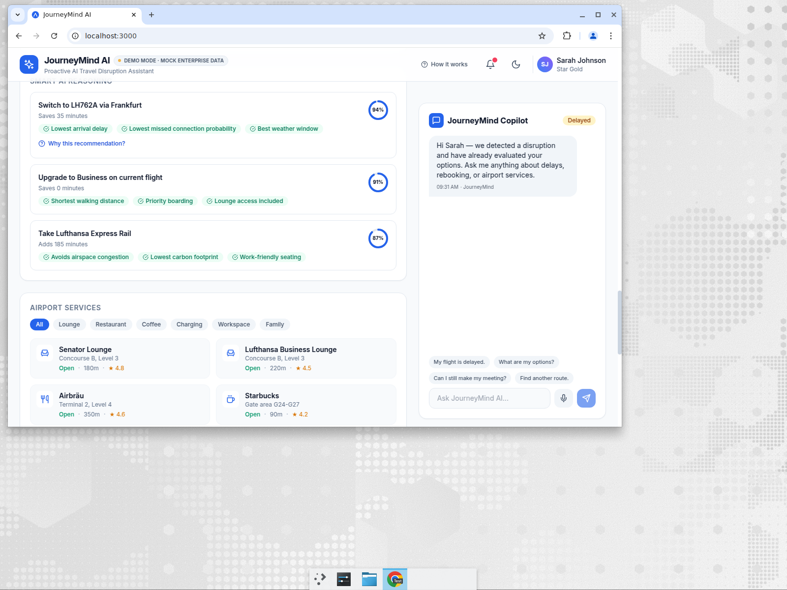
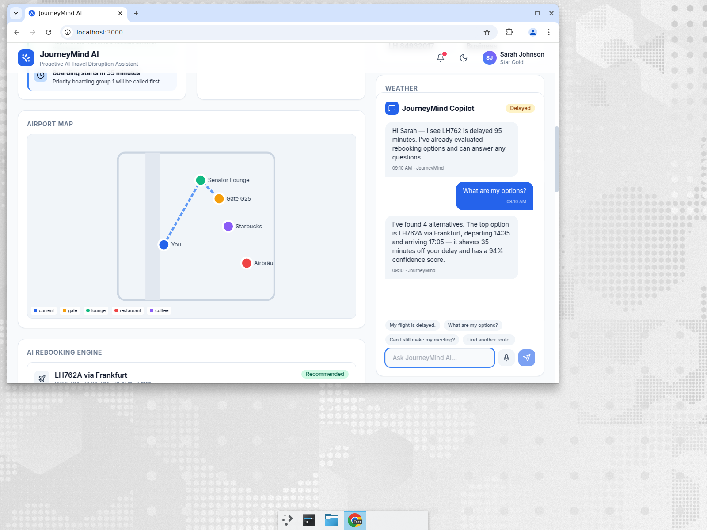
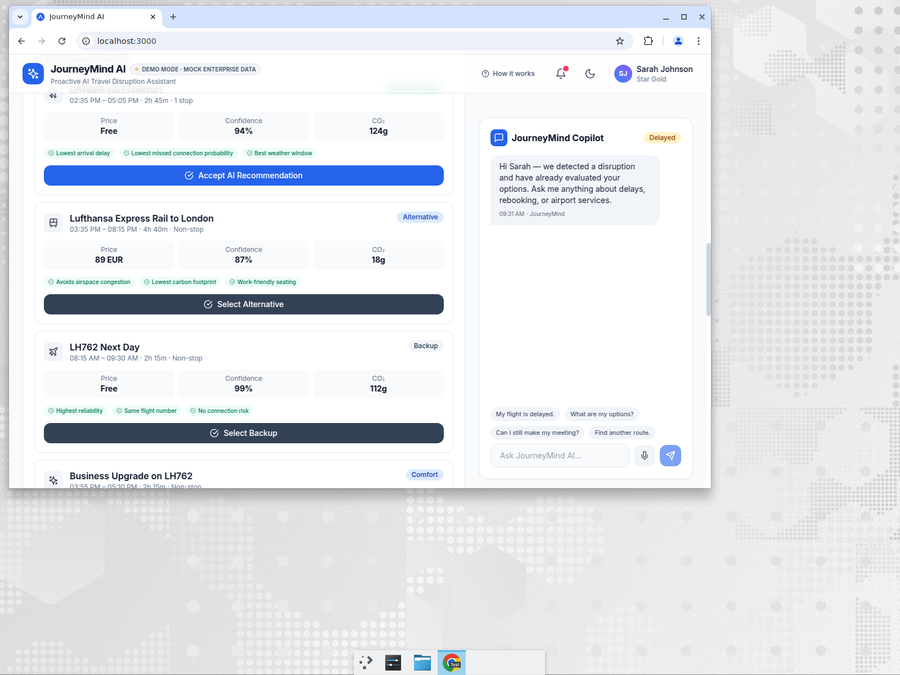
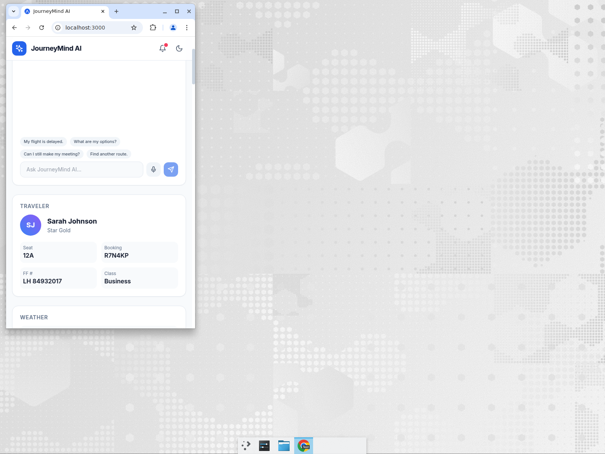
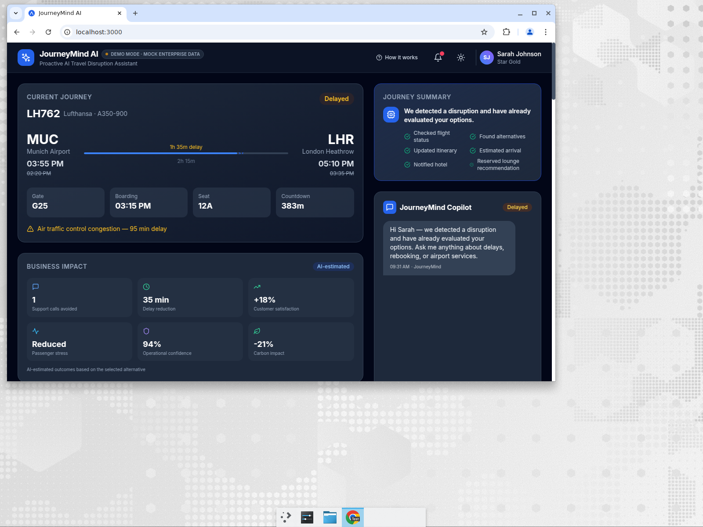

# JourneyMind AI

> **Proactive AI Travel Disruption Assistant**

JourneyMind AI is a hackathon-ready enterprise demo that demonstrates an **AI orchestration platform** for travel disruption management. It proactively detects flight disruptions, reasons over live (mock) travel data, evaluates alternatives, explains its decisions, predicts business impact, updates itineraries, and answers traveler questions — all in real time.

---

## Overview

When a flight is delayed, cancelled, or a gate changes, JourneyMind AI does not wait for the traveler to search for help. It:

- Detects disruptions from mock flight data
- Evaluates rebooking alternatives (flights, rail, upgrades)
- Explains recommendations with confidence scores and reasoning
- Suggests lounges, restaurants, charging stations, and workspaces
- Displays an airport map, timeline, weather, and AI decision timeline
- Explains recommendations with a dedicated explainability modal
- Surfaces business impact metrics from AI-estimated outcomes
- Provides a conversational AI copilot with OpenAI fallback support

---

## Architecture

```
journeymind-ai/
├── backend/
│   ├── main.py              # FastAPI application & mock data
│   └── requirements.txt     # Python dependencies
├── docs/
│   └── screenshots/         # Demo screenshots for README and LinkedIn
├── frontend/
│   ├── src/
│   │   ├── App.tsx          # Single-page enterprise dashboard
│   │   ├── main.tsx         # React entrypoint
│   │   └── index.css        # Tailwind base + custom styles
│   ├── e2e/
│   │   └── journeymind.spec.ts  # Playwright API + UI smoke tests
│   ├── playwright.config.ts
│   ├── index.html
│   ├── package.json
│   ├── vite.config.ts       # Vite with API proxy
│   ├── tailwind.config.js
│   └── tsconfig.json
└── README.md
```

### Tech Stack

| Layer       | Technology                          |
|-------------|-------------------------------------|
| Frontend    | React 18, TypeScript, Vite, Tailwind CSS, Lucide icons |
| Backend     | FastAPI, Python 3.10, Uvicorn       |
| AI          | OpenAI API with intelligent mock fallback |
| Communication | REST APIs (CORS enabled)            |
| Styling     | Responsive, dark/light mode, animations |

---

## Features

- **Large Flight Card** — airline, route, gate, boarding time, status, countdown, delay reason
- **Proactive AI Panel** — automatically generated travel insights (delays, connections, lounges, walking times, security queues)
- **AI Copilot Chat** — conversational assistant with quick prompts, typing indicator, and source attribution (OpenAI / JourneyMind)
- **Rebooking Engine** — alternative flights, high-speed rail, next-day options, business upgrades with price, duration, confidence, and recommendation
- **Smart Recommendations** — explains *why* an option is best (lowest delay, cost, reliability, walking distance, transfer risk)
- **Airport Services** — lounges, restaurants, coffee, charging, workspaces, family areas with ratings and distances
- **Journey Timeline** — check-in, security, gate, boarding, departure, arrival, hotel
- **Airport Map Placeholder** — SVG map with current position, gate, lounge, restaurant, and walking path
- **AI Decision Timeline** — chronological, timestamped view of autonomous agent actions: disruption detection, alternative evaluation, risk comparison, recommendation generation, traveler notification
- **Journey Summary** — proactive summary shown before user interaction: "We detected a disruption and have already evaluated your options"
- **Business Impact Panel** — AI-estimated executive metrics: support calls avoided, delay reduction, customer satisfaction, passenger stress, operational confidence, carbon impact
- **AI Explainability Modal** — "Why this recommendation?" with decision inputs, decision process, confidence score, and ranked factors
- **Demo Mode Badge** — "Demo Mode · Mock Enterprise Data" avoids implying live airline integrations
- **Architecture Modal** — "How JourneyMind Works" visual flow from travel event to AI orchestrator, reasoning engine, recommendation engine, and passenger experience
- **Weather & Travel Alerts** — origin/destination weather and unread notifications
- **Dark / Light Mode** — toggle with Tailwind `dark` class
- **Voice Input Mock** — microphone button triggers mock capture and sends a query

---

## Screenshots

| Dashboard (Light) | AI Copilot | Rebooking Engine | Mobile | Dark Mode |
|---|---|---|---|---|
|  |  |  |  |  |

---

## Prerequisites

- **Python** 3.10 or newer (`python3` on macOS)
- **Node.js** 18 or newer (`node`)
- **npm** 9 or newer

Verified on Python 3.10 and Node 20.x.

## Quick Start (one command)

From the project root:

```bash
git clone https://github.com/azamasad/journeymind-ai.git
cd journeymind-ai
./run_demo.sh
```

This creates the Python virtual environment, installs dependencies, starts the backend on `http://localhost:8000`, starts the Vite frontend on `http://localhost:3000`, and prints the URLs.

To stop:

```bash
./run_demo.sh stop
```

## Manual Run Instructions

### 1. Clone the repository

```bash
git clone https://github.com/azamasad/journeymind-ai.git
cd journeymind-ai
```

### 2. Backend

```bash
cd backend
python3 -m venv .venv
source .venv/bin/activate
python3 -m pip install -r requirements.txt
uvicorn main:app --host 0.0.0.0 --port 8000 --reload
```

Backend will be available at `http://localhost:8000`.

The state is held in memory; restart the server to reset to the initial disrupted scenario.

### 3. Frontend

In a new terminal:

```bash
cd frontend
npm install
npm run dev
```

Frontend will be available at `http://localhost:3000` and proxies `/api` calls to the backend.

If `npm install` warns about transitive legacy packages, those warnings do not affect the demo runtime.

### 4. Build, lint, and test

```bash
cd frontend
npm run lint
npm run build
npx playwright install chromium   # first time only
npm run test:e2e
```

### Optional: OpenAI Integration

Set the environment variable to use a real OpenAI model:

```bash
export OPENAI_API_KEY=sk-...
```

If no key is provided, JourneyMind AI falls back to intelligent, context-aware mocked responses.

---

## API Endpoints

| Endpoint              | Method | Description                                |
|-----------------------|--------|--------------------------------------------|
| `/`                   | GET    | Health check                               |
| `/dashboard`          | GET    | Full dashboard payload                     |
| `/chat`               | POST   | `{ "message": "..." }` → AI reply         |
| `/recommendations`    | GET    | Ranked recommendations + alternatives      |
| `/rebook`             | POST   | `{ "option_id": "alt-1" }` → new itinerary |
| `/alerts`             | GET    | Travel alerts                              |
| `/mockdata`           | GET    | Raw mock dataset                           |

---

## 5-Minute Demo Script

1. Open `http://localhost:3000` and point out the **Demo Mode** badge, then the **Journey Summary**: "We detected a disruption and have already evaluated your options."
2. Show the **AI Decision Timeline** — timestamped autonomous agent actions (detect, evaluate, compare, notify).
3. Point out the **Business Impact** panel and explain that these are AI-estimated enterprise outcomes.
4. Open the **Rebooking Engine** and explain the top option (LH762A via Frankfurt) with price, confidence, decision factors, and CO₂.
5. Click **Accept AI Recommendation** and show the toast + updated flight card, timeline, proactive insights, and journey summary.
6. Click **Why this recommendation?** to open the **AI Explainability** modal and walk through Decision Inputs, Process, and Factors.
7. Open **Airport Services** and filter to lounges/coffee.
8. Use the **AI Copilot** chat: ask "What are my options?" and show the context-aware reply.
9. Click **How it works** to show the architecture modal, then toggle **dark mode** and scroll through the timeline and map.

---

## Future Roadmap

- Real-time flight API integration (FlightAware, Amadeus, airline APIs)
- Persistent traveler profiles and booking history
- Push notifications and SMS alerts
- Multi-language support
- Voice-to-text with real ASR
- Carbon footprint comparison charts
- Delay prediction model
- Mobile app with React Native

---

## License

MIT — built for demonstration and hackathon purposes.
