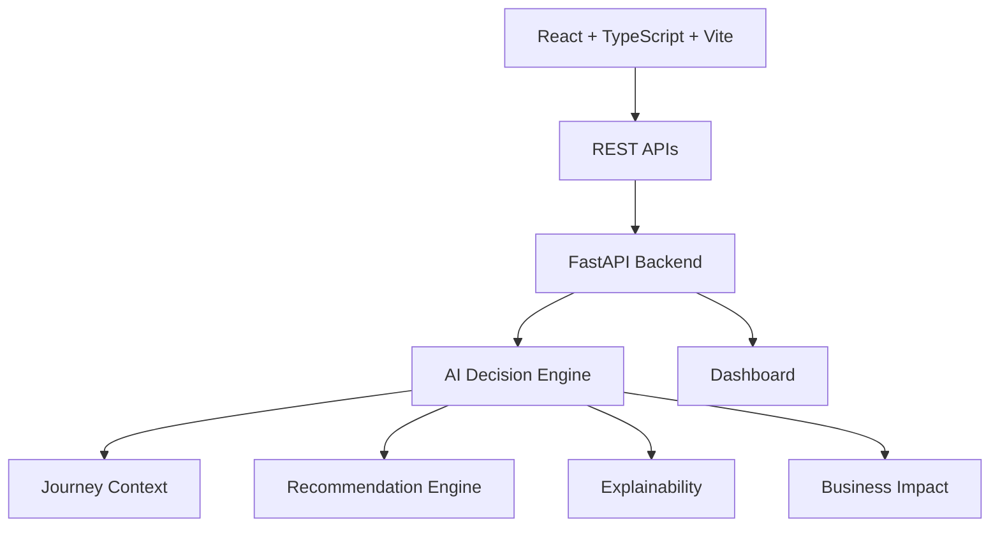

# JourneyMind AI

> **Proactive AI Travel Disruption Assistant**

JourneyMind AI is a hackathon-ready enterprise demo that demonstrates an **AI orchestration platform** for travel disruption management. It proactively detects flight disruptions, reasons over live (mock) travel data, evaluates alternatives, explains its decisions, predicts business impact, updates itineraries, and answers traveler questions — all in real time.

---

## Overview

When a flight is delayed, cancelled, or a gate changes, JourneyMind AI does not wait for the traveler to search for help. It:

- Detects disruptions from mock flight data
- Evaluates rebooking alternatives (flights, rail, upgrades)
- Explains recommendations with confidence scores and reasoning
- Suggests lounges, restaurants, charging stations, and workspaces
- Displays an airport map, timeline, weather, and AI decision timeline
- Explains recommendations with a dedicated explainability modal
- Surfaces business impact metrics from AI-estimated outcomes
- Provides a conversational AI copilot with OpenAI fallback support

---

## Architecture

### Repository Structure

| Path                    | Contents                                                |
|--------------------------|----------------------------------------------------------|
| `backend/`               | FastAPI application (`main.py`) and mock data, plus `requirements.txt` |
| `frontend/src/`          | React + TypeScript dashboard (`App.tsx`), entrypoint, and styles |
| `frontend/e2e/`          | Playwright API + UI smoke tests                          |
| `docs/screenshots/`      | Demo screenshots used in this README                     |
| `run_demo.sh`            | One-command start/stop script for the backend and frontend |
| `ARCHITECTURE.md`        | Detailed system architecture and request flow             |
| `LICENSE`                | MIT license                                               |

See `ARCHITECTURE.md` for a full breakdown of components and data flow.

### Tech Stack

| Layer       | Technology                          |
|-------------|-------------------------------------|
| Frontend    | React 18, TypeScript, Vite, Tailwind CSS, Lucide icons |
| Backend     | FastAPI, Python 3.10, Uvicorn       |
| AI          | OpenAI API with intelligent mock fallback |
| Communication | REST APIs (CORS enabled)            |
| Styling     | Responsive, dark/light mode, animations |

### Architecture Diagram



### Request Flow

1. The user opens the dashboard at `http://localhost:3000`.
2. The frontend calls `GET /dashboard`.
3. The backend builds the journey context from the current flight, weather, alternatives, and services.
4. The AI decision engine evaluates alternatives and selects the top recommendation.
5. The backend returns the recommendation, explainability data, business impact, timeline, and alerts.
6. The user views recommendations and optionally accepts one.
7. The frontend calls `POST /rebook` with the chosen alternative.
8. The backend updates the current itinerary, timeline, and business impact.
9. The dashboard refreshes and shows the new journey.

---

## Features

- **Large Flight Card** — airline, route, gate, boarding time, status, countdown, delay reason
- **Proactive AI Panel** — automatically generated travel insights (delays, connections, lounges, walking times, security queues)
- **AI Copilot Chat** — conversational assistant with quick prompts, typing indicator, and source attribution (OpenAI / JourneyMind)
- **Rebooking Engine** — alternative flights, high-speed rail, next-day options, business upgrades with price, duration, confidence, and recommendation
- **Smart Recommendations** — explains *why* an option is best (lowest delay, cost, reliability, walking distance, transfer risk)
- **Airport Services** — lounges, restaurants, coffee, charging, workspaces, family areas with ratings and distances
- **Journey Timeline** — check-in, security, gate, boarding, departure, arrival, hotel
- **Airport Map Placeholder** — SVG map with current position, gate, lounge, restaurant, and walking path
- **AI Decision Timeline** — chronological, timestamped view of autonomous agent actions: disruption detection, alternative evaluation, risk comparison, recommendation generation, traveler notification
- **Journey Summary** — proactive summary shown before user interaction: "A major disruption has occurred. JourneyMind AI has already analyzed the situation and prepared the best options."
- **Business Impact Panel** — AI-estimated executive metrics: support calls avoided, delay reduction, customer satisfaction, passenger stress, operational confidence, carbon impact
- **AI Explainability Modal** — "Why this recommendation?" with decision inputs, decision process, confidence score, and ranked factors
- **Demo Mode Badge** — "Demo Mode · Simulated disruption" avoids implying live airline integrations
- **Architecture Modal** — "How JourneyMind Works" visual flow from travel event to AI orchestrator, reasoning engine, recommendation engine, and passenger experience
- **Weather & Travel Alerts** — origin/destination weather and unread notifications
- **Dark / Light Mode** — toggle with Tailwind `dark` class
- **Voice Input Mock** — microphone button triggers mock capture and sends a query

---

## Screenshots

| Dashboard (Light) | AI Copilot | Rebooking Engine | Mobile | Dark Mode |
|---|---|---|---|---|
|  |  |  |  |  |

---

## Prerequisites

- **Python** 3.10 or newer (`python3` on macOS)
- **Node.js** 18 or newer (`node`)
- **npm** 9 or newer

Tested with Python 3.10+ and Node.js 18+, matching the minimum versions declared above and in `frontend/package.json` `engines`.

## Quick Start (one command)

From the project root:

```bash
git clone https://github.com/azamasad/journeymind-ai.git
cd journeymind-ai
./run_demo.sh
```

This creates the Python virtual environment, installs dependencies, starts the backend on `http://localhost:8000`, starts the Vite frontend on `http://localhost:3000`, and prints the URLs.

To stop:

```bash
./run_demo.sh stop
```

## Manual Run Instructions

### 1. Clone the repository

```bash
git clone https://github.com/azamasad/journeymind-ai.git
cd journeymind-ai
```

### 2. Backend

```bash
cd backend
python3 -m venv .venv
source .venv/bin/activate
python3 -m pip install -r requirements.txt
uvicorn main:app --host 0.0.0.0 --port 8000 --reload
```

Backend will be available at `http://localhost:8000`.

The state is held in memory; restart the server to reset to the initial disrupted scenario.

### 3. Frontend

In a new terminal:

```bash
cd frontend
npm install
npm run dev
```

Frontend will be available at `http://localhost:3000` and proxies `/api` calls to the backend.

If `npm install` warns about transitive legacy packages, those warnings do not affect the demo runtime.

### 4. Build, lint, and test

```bash
cd frontend
npm run lint
npm run build
npx playwright install chromium   # first time only
npm run test:e2e
```

### Optional: OpenAI Integration

Set the environment variable to use a real OpenAI model:

```bash
export OPENAI_API_KEY=sk-...
```

If no key is provided, JourneyMind AI falls back to intelligent, context-aware mocked responses.

---

## API Endpoints

| Endpoint              | Method | Description                                |
|-----------------------|--------|--------------------------------------------|
| `/`                   | GET    | Health check                               |
| `/dashboard`          | GET    | Full dashboard payload                     |
| `/chat`               | POST   | `{ "message": "..." }` → AI reply         |
| `/recommendations`    | GET    | Ranked recommendations + alternatives      |
| `/rebook`             | POST   | `{ "option_id": "alt-1" }` → new itinerary |
| `/alerts`             | GET    | Travel alerts                              |
| `/mockdata`           | GET    | Raw mock dataset                           |

---

## 5-Minute Demo Script

1. Open `http://localhost:3000` and point out the **Demo Mode** badge, then the **Journey Summary**: "A major disruption has occurred. JourneyMind AI has already analyzed the situation and prepared the best options."
2. Show the **AI Decision Timeline** — timestamped autonomous agent actions (detect, evaluate, compare, notify).
3. Point out the **Business Impact** panel and explain that these are AI-estimated enterprise outcomes.
4. Open the **Rebooking Engine** and explain the top option (LH762A via Frankfurt) with price, confidence, decision factors, and CO₂.
5. Click **Accept AI Recommendation** and show the toast + updated flight card, timeline, proactive insights, and journey summary.
6. Click **Why this recommendation?** to open the **AI Explainability** modal and walk through Decision Inputs, Process, and Factors.
7. Open **Airport Services** and filter to lounges/coffee.
8. Use the **AI Copilot** chat: ask "What are my options?" and show the context-aware reply.
9. Click **How it works** to show the architecture modal, then toggle **dark mode** and scroll through the timeline and map.

---

## Project Limitations

JourneyMind AI is a **hackathon prototype** focused on demonstrating AI orchestration and explainability. It is **not** a production system. Key limitations:

- **In-memory state only.** All data is held in Python module-level variables. Restarting the backend resets the demo; there is no database.
- **Mock travel data.** Flight, weather, alternatives, and airport services are hardcoded. There are no live airline, airport, or weather integrations.
- **Deterministic AI reasoning.** The decision engine uses curated rules and pre-scored alternatives. LLM reasoning is only used for the copilot chat, and only when `OPENAI_API_KEY` is set; otherwise a context-aware mock reply is returned.
- **Single traveler, single journey.** The prototype models one passenger and one disrupted flight.
- **No authentication or persistence.** No login, no sessions, no booking history.
- **No deployment artifacts.** No Docker, CI/CD, or cloud configuration is included.

See `ARCHITECTURE.md` for the current implementation details and the **Future Evolution** section for the production path.

---

## Future Roadmap

- Real-time flight API integration (FlightAware, Amadeus, airline APIs)
- Persistent traveler profiles and booking history
- Push notifications and SMS alerts
- Multi-language support
- Voice-to-text with real ASR
- Carbon footprint comparison charts
- Delay prediction model
- Mobile app with React Native

---

## License

MIT — built for demonstration and hackathon purposes.
